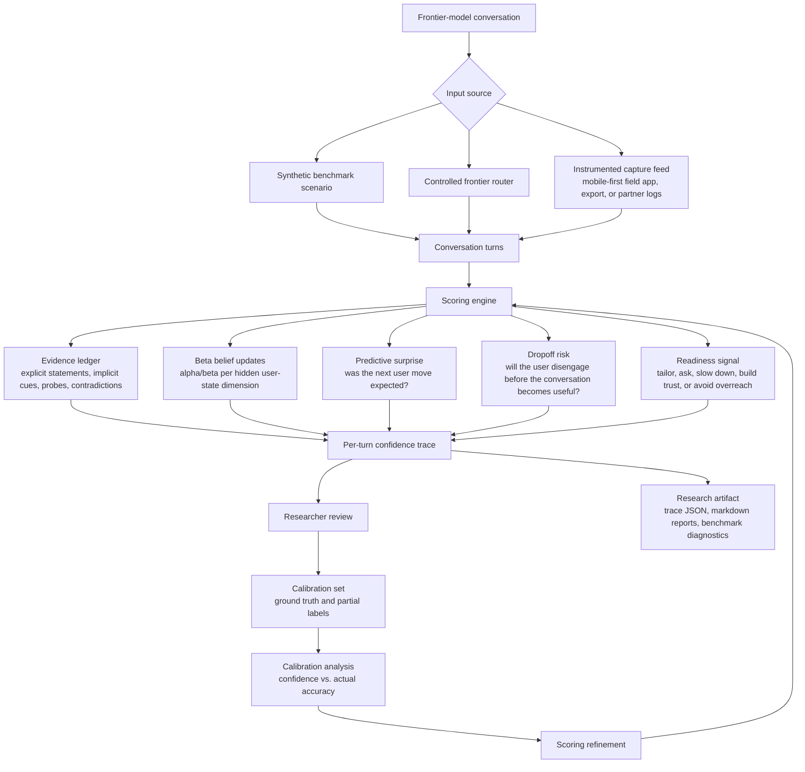
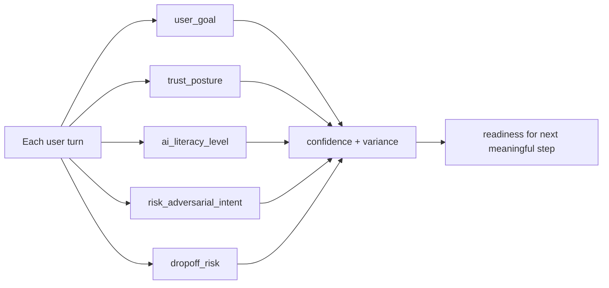
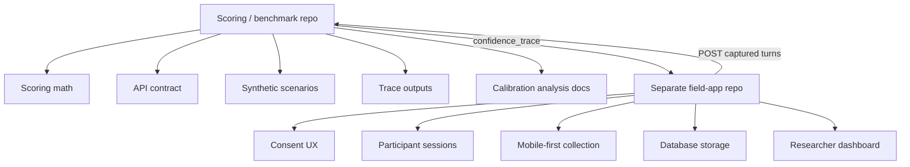

# Architecture Diagram

**Author / Project Owner:** Kelsey Ontko

## North Star

At each turn, does the model understand enough about the user to drive the next meaningful conversational step, and is that confidence justified?

## Research Pipeline

## Hidden User-State Dimensions

## Repo Boundary

## Plain-English Read

The scoring repo is the benchmark method. It accepts conversation turns, updates probabilistic beliefs about hidden user-state dimensions, and emits a turn-by-turn confidence trace that helps evaluate whether the model should tailor, ask for context, slow down, build trust, explain AI use, or avoid overreach. The field app is separate because it is only the instrument for collecting calibration data from real interactions.
